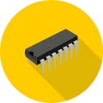

# ROM Builder

 ROM Builder 
merges several hex files into a single ROM file ready to be burned to an 
EPROM or extracts images out of a ROM file to separate image files.

## Installation

TBD

## Usage

First you must create a ROM configuration file that contains information on
the ROM file and the images that are contained in the ROM file. This is an example
configuration file for a 64K ROM with five images, four of 8K, one of 16K and
an empty slot of 16K.

```json{
  "Rom": {
    "Default": "0xFF",
    "Size": "0x10000",
    "Filename": "roms/24886009.BIN"
  },
  "Images": [
    {
      "Offset": "0x0000",
      "Size": "0x2000",
      "Filename": "imgs/2-MBasic_32K_SIO2.bin"
    },
    {
      "Offset": "0x2000",
      "Size": "0x2000",
      "Filename": "imgs/4-MBasic_56K_SIO2.bin"
    },
    {
      "Offset": "0x4000",
      "Size": "0x4000",
      "Filename": "imgs/88-SCMonitor_MBasic_CPM_64K.bin"
    },
    {
      "Offset": "0x8000",
      "Size": "0x2000",
      "Filename": "imgs/6-CPM_Monitor_64K_SIO2.bin"
    },
    {
      "Offset": "0xE000",
      "Size": "0x2000",
      "Filename": "imgs/9-SCMonitor.bin"
    }
  ]
}
```

Notice that all sizes and offsets are strings in hex. This file can be used
to extract the five image files out of the rom or to combine the five image
files into one rom file. The Default in ROM is the default byte to set
uninitialized bytes to, often a NOP.

The program does some rudementary checks, but expects that you did your math
correctly and all the sizes and offsets are correct. I may add more checks if
needed.

Given the above file named `24886009.json`, to extract the five images out of `roms/24886009.BIN`,
run the command,

```sh
RomBuilder extract 24886009.json
```

To combine the five images in the `imgs` directory into a new rom, run the command,

```sh
RomBuilder build 24886009.json
```

## Samples

There are sample configurations, roms and images in the `Samples` directory
for various things that I find useful. See the `README.md` file in each directory.
Feel free to add or request more.
